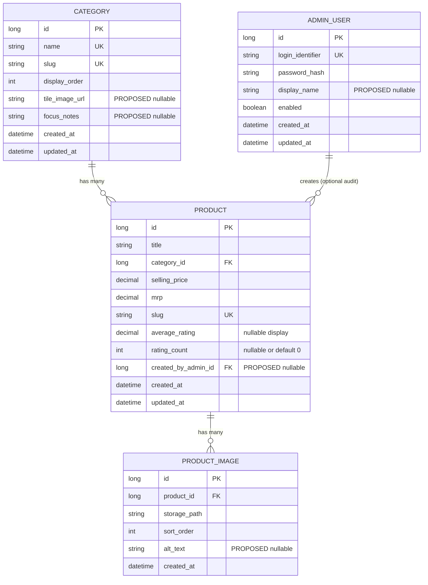

# MA CREATIONS — Database ER Design

**Step:** 3 — Database architecture (logical ER only)  
**No SQL. No application code.**

**Status layers (post client clarification)**

| Layer | Meaning |
|---|---|
| **CURRENT V1 freeze** | Four entities only: Category, Product, ProductImage, AdminUser (as built) |
| **FINAL confirmed** | Cart, Wishlist, Order, Payment (**UPI** + **Credit/Debit Card** + **Net Banking** + **COD**), product Hide/Unpublish — **required next**; **DDL not invented here** |
| **PENDING** | Gateway/provider (not selected), **COD charge rule**, storage strategy, **auth & guest-tracking mechanism design** (guest+accounts CONFIRMED), Shop Now, bestseller rules |

**Sources reviewed**

- `REQUIREMENTS.md`
- `SYSTEM_ARCHITECTURE.md`
- `DATABASE_DESIGN.md`
- `API_DESIGN.md`
- `USER_WORKFLOW.md`
- `CLIENT_CONFIRMATIONS.md`
- `FIGMA_SPECIFICATION.md`
- PDF taxonomy (5 fixed categories)

**Legend**

| Tag | Meaning |
|---|---|
| **CONFIRMED** | Required for PDF-confirmed v1 screens/CMS behavior |
| **STRUCTURAL** | Technical field needed to implement a confirmed entity (id, timestamps, slug); not named in the PDF but not a new business feature |
| **PROPOSED** | Useful or tempting; **not** approved until client confirmation |
| **DERIVED** | Calculated at read time; do not store as source of truth |
| **EXCLUDED FROM CURRENT V1 FREEZE** | Not in the catalog-only schema freeze — may still be **FINAL confirmed** for a later phase (see status layers) |

---

## 1. Confirmed database entities for v1

These four entities are sufficient for:

- Homepage category tiles + product grids  
- PLP (category + sort by price / newest)  
- PDP (title, pricing, rating display, image gallery)  
- Admin login + Add Product (title, category, image, selling price, MRP)

| # | Entity | Status | Why confirmed |
|---|---|---|---|
| 1 | **Category** | CONFIRMED | Exactly 5 taxonomy categories; CMS dropdown; homepage tiles; PLP |
| 2 | **Product** | CONFIRMED | Catalog + CMS create fields + PDP/PLP pricing + rating **display** |
| 3 | **ProductImage** | CONFIRMED | CMS image upload; card photo; PDP main + thumbnails |
| 4 | **AdminUser** | CONFIRMED | CMS login without coding knowledge |

### Explicitly NOT in the CURRENT V1 catalog freeze

Do **not** invent DDL for these in the catalog-only freeze. Several are now **FINAL confirmed** for a later commerce phase — see `CLIENT_CONFIRMATIONS.md`.

| Entity | CURRENT V1 freeze | FINAL business scope |
|---|---|---|
| Customer / User | Omit from CURRENT freeze | **CONFIRMED need** for optional accounts — schema/auth PENDING design |
| Address | Omit | Guest + account checkout CONFIRMED; fields PENDING |
| Cart / CartItem | Omit | **CONFIRMED need** — persistence strategy PENDING |
| Wishlist / WishlistItem | Omit | **CONFIRMED need** — account-linked where applicable |
| Order / OrderItem | Omit | **CONFIRMED need** — guest + registered; Order ID required |
| Payment | Omit | **CONFIRMED** — UPI + Credit/Debit Card + Net Banking + COD; gateway/provider PENDING; COD charge rule PENDING — **not** UI-only |
| Shipment | Omit | PENDING |
| Coupon / ProductVariant / Inventory | Omit | PENDING |
| Review (row-per-review) | Omit | Write/import PENDING; aggregates may live on Product |
| SiteSetting | Omit | WhatsApp `6395700831` + Instagram `https://www.instagram.com/macreations.living/` may stay in env |
| HeroBanner / SubCategory | Omit | PENDING CMS / navigability |

---

## 2. Entity specifications

### 2.1 Category — CONFIRMED

**Purpose:** Store the **five fixed** product categories for navigation, PLP routing, and the admin Add Product dropdown.

| Field | Nullability concept | Source | Notes |
|---|---|---|---|
| `id` | NOT NULL | STRUCTURAL | Primary key |
| `name` | NOT NULL | CONFIRMED (PDF) | Exact display name (see §8) |
| `slug` | NOT NULL | STRUCTURAL | URL-safe key for PLP (`/category/{slug}`) |
| `display_order` | NOT NULL | STRUCTURAL | Preserve PDF order 1–5 |
| `tile_image_url` | NULLABLE | PROPOSED | Homepage circular tiles need images; CMS tile upload not in PDF. May be static assets in v1 |
| `focus_notes` | NULLABLE | PROPOSED | Optional text for “Sub-Categories / Focus” if no subcategory table (§9) |
| `created_at` | NOT NULL | STRUCTURAL | Audit |
| `updated_at` | NOT NULL | STRUCTURAL | Audit |

**Primary key:** `id`

**Foreign keys:** none

**Constraints (logical)**

- Exactly **5** seed rows matching PDF names  
- `name` unique; `slug` unique  
- Application must not allow a 6th category unless client changes taxonomy  

**Relationships**

- **One Category → Many Products** (CONFIRMED)

---

### 2.2 Product — CONFIRMED

**Purpose:** Core sellable catalog item for storefront cards/PDP and admin create.

| Field | Nullability concept | Source | Notes |
|---|---|---|---|
| `id` | NOT NULL | STRUCTURAL | Primary key |
| `title` | NOT NULL | CONFIRMED (PDF CMS) | Product Title |
| `category_id` | NOT NULL | CONFIRMED (PDF CMS) | FK → Category; must be one of the 5 |
| `selling_price` | NOT NULL | CONFIRMED (PDF CMS) | Discounted / selling price (INR) |
| `mrp` | NOT NULL | CONFIRMED (PDF CMS) | MRP (INR) |
| `slug` | NOT NULL | STRUCTURAL | PDP URL (`/product/{slug}`) |
| `created_at` | NOT NULL | STRUCTURAL / CONFIRMED need | Required to support PLP sort **Newest arrivals** |
| `updated_at` | NOT NULL | STRUCTURAL | Audit |
| `average_rating` | NULLABLE | CONFIRMED display need | PDP star rating (e.g. 4.0). Null = hide rating until data exists |
| `rating_count` | NULLABLE | CONFIRMED display need | PDP count (e.g. 135). Prefer NOT NULL with default 0 **or** NULL when unknown — see §7 |
| `created_by_admin_id` | NULLABLE | PROPOSED audit | FK → AdminUser; see §5.4 |

**Derived (do not store as authoritative)**

| Field | Rule |
|---|---|
| `percent_off` | `(mrp - selling_price) / mrp` at API/UI time |

**Primary key:** `id`

**Foreign keys**

- `category_id` → `Category.id` (**NOT NULL**, CONFIRMED)
- `created_by_admin_id` → `AdminUser.id` (**NULLABLE**, PROPOSED audit only)

**Logical rules**

- One product belongs to **exactly one** category (PDF dropdown implies single category)  
- `selling_price` should be ≤ `mrp` (application validation; confirm edge cases with client)  
- No inventory column in v1  

**Relationships**

- **Many Products → One Category**  
- **One Product → Many ProductImages**  
- **Many Products → One AdminUser** (optional audit; PROPOSED)

---

### 2.3 ProductImage — CONFIRMED

**Purpose:** Store uploaded product imagery for listing cards and PDP gallery (zoom + thumbnails).

| Field | Nullability concept | Source | Notes |
|---|---|---|---|
| `id` | NOT NULL | STRUCTURAL | Primary key |
| `product_id` | NOT NULL | CONFIRMED | FK → Product |
| `storage_path` or `url` | NOT NULL | CONFIRMED upload | Where file lives; storage backend CLIENT CONFIRMATION REQUIRED |
| `sort_order` | NOT NULL | STRUCTURAL | `0` = primary (card + main PDP image) |
| `alt_text` | NULLABLE | PROPOSED | Accessibility; not in PDF |
| `created_at` | NOT NULL | STRUCTURAL | Audit |

**Primary key:** `id`

**Foreign keys**

- `product_id` → `Product.id` (**NOT NULL**)

**Logical rules**

- PDF CMS says “Image Upload” (singular); PDP requires a **gallery** → allow **one or more** images  
- Max images per product: **CLIENT CONFIRMATION REQUIRED** (no hard DB limit until confirmed)  
- Deleting a product should cascade-delete images (implementation detail for later SQL)

**Relationships**

- **One Product → Many ProductImages** (CONFIRMED)

---

### 2.4 AdminUser — CONFIRMED

**Purpose:** Authenticate the store owner for CMS login and Add Product.

| Field | Nullability concept | Source | Notes |
|---|---|---|---|
| `id` | NOT NULL | STRUCTURAL | Primary key |
| `login_identifier` | NOT NULL | CONFIRMED need; shape unconfirmed | Email **or** username — **CLIENT CONFIRMATION REQUIRED** which |
| `password_hash` | NOT NULL | STRUCTURAL | Spring Security; never store plain password |
| `display_name` | NULLABLE | PROPOSED | Optional UI greeting |
| `enabled` | NOT NULL | STRUCTURAL | Disable account without delete |
| `created_at` | NOT NULL | STRUCTURAL | Audit |
| `updated_at` | NOT NULL | STRUCTURAL | Audit |

**Primary key:** `id`

**Foreign keys:** none

**Logical rules**

- At least one enabled admin for v1  
- Multiple roles / staff accounts: **CLIENT CONFIRMATION REQUIRED**  
- Password reset flow: **CLIENT CONFIRMATION REQUIRED**

**Relationships**

- **One AdminUser → Many Products** via optional `created_by_admin_id` (PROPOSED audit)

---

### 2.5 Rating display — CONFIRMED as Product fields, not a Review table

**Confirmed UI need:** PDP shows star rating and rating count (PDF example `4.0 ★ [135 ratings]`).

**v1 data decision (CONFIRMED approach for schema):**

- Store **`average_rating`** and **`rating_count`** on **Product**  
- Do **not** create a `Review` entity in v1  

| Approach | Status |
|---|---|
| Aggregates on Product | **CONFIRMED for v1 ER** |
| Separate Review rows + customer write | PROPOSED / CLIENT CONFIRMATION REQUIRED |
| Import from Meesho then freeze on Product | CLIENT CONFIRMATION REQUIRED (data source, not a new table) |

---

## 3. Mermaid ER diagram (v1 confirmed)



**Not shown (excluded from v1):** Customer, Cart, Wishlist, Order, Payment, Coupon, Variant, Inventory, Review, SiteSetting, HeroBanner, SubCategory.

---

## 4. Cardinality explained

### 4.1 One-to-one (1:1)

**None required in confirmed v1.**

Examples that would be 1:1 if later confirmed (not in v1): Product ↔ ProductDetail extension table; Customer ↔ CustomerProfile.

### 4.2 One-to-many (1:N) — used in v1

| Parent | Child | Cardinality | Confirmed? |
|---|---|---|---|
| Category | Product | 1 Category : N Products | **Yes** |
| Product | ProductImage | 1 Product : N Images | **Yes** |
| AdminUser | Product | 1 Admin : N Products (audit) | Optional / PROPOSED |

### 4.3 Many-to-many (M:N)

**None in confirmed v1.**

PDF implies each product has **one** category via a single dropdown. There is no product↔category junction table.

If the client later allows multi-category products, that would introduce M:N (`product_category`) — **CLIENT CONFIRMATION REQUIRED**; contradicts current CMS form.

---

## 5. Specific relationship designs

### 5.1 Category → Product

```
Category (1) ──────── < (N) Product
```

| Rule | Detail |
|---|---|
| Cardinality | One-to-many |
| FK | `Product.category_id` → `Category.id` |
| Nullability | `category_id` **NOT NULL** |
| Business | Every product must map to exactly one of the five PDF categories |
| UI | Admin Category Dropdown; homepage 5 tiles; PLP filtered by category |
| Delete policy (later SQL) | Prefer restrict deleting a category that has products; categories are seed-fixed anyway |

### 5.2 Product → Product Images

```
Product (1) ──────── < (N) ProductImage
```

| Rule | Detail |
|---|---|
| Cardinality | One-to-many |
| FK | `ProductImage.product_id` → `Product.id` |
| Nullability | `product_id` **NOT NULL** |
| Ordering | `sort_order` ascending; lowest = primary |
| CMS | Minimum one image on create (application rule) |
| PDP | Main image = primary; others = thumbnails |
| Gallery count | Multi-image supported for PDP; max count **CLIENT CONFIRMATION REQUIRED** |

### 5.3 Product → Rating display data

```
Product
  ├── average_rating   (nullable decimal)
  └── rating_count     (nullable int or default 0)
```

| Rule | Detail |
|---|---|
| Cardinality | N/A (attributes on Product, not a separate entity) |
| Confirmed UI | PDP stars + count |
| Not confirmed | Per-review rows, customer-authored reviews, moderation |
| PLP ratings | Screenshot-informed; optional in UI — same Product fields if shown |

### 5.4 Admin → Product creation

```
AdminUser (1) ──────── < (N) Product   [optional audit link]
```

| Rule | Detail |
|---|---|
| Confirmed | Admin can log in and create products |
| FK | `Product.created_by_admin_id` → `AdminUser.id` |
| Nullability | **NULLABLE** (PROPOSED) — product remains valid if audit omitted |
| Alternative | Omit FK entirely and rely on application logs — also acceptable for v1 |
| Not confirmed | Edit/delete/list of products by admin (may still need same Product table later) |

Creating a product always sets `category_id`, prices, title, and at least one `ProductImage` row — that is the confirmed write path.

---

## 6. Tables deliberately omitted (unconfirmed features)

| Feature | Why no table |
|---|---|
| Checkout / Orders | Not in PDF screens |
| Customer accounts | Not in PDF |
| Payments | Badges only |
| Shipping | Not specified |
| Coupons | Not specified |
| Inventory | Not specified |
| Cart persistence | Unconfirmed; client cart can be front-end only |
| Wishlist persistence | Unconfirmed |
| Review entity | Display-only aggregates on Product |
| SubCategory entity | See §9 — design decision, not confirmed requirement |

---

## 7. Fields that cannot be finalized until client confirmation

| Topic | Field / decision | Blocking question |
|---|---|---|
| Admin login shape | `login_identifier` = email vs username | CLIENT_CONFIRMATIONS §7.3 |
| Rating source | How `average_rating` / `rating_count` get values | Manual entry? Meesho import? Later reviews? |
| Rating null vs zero | Hide vs show `0 (0)` | UX preference |
| Pay Later | Store `pay_later_price` on Product or omit | §6.2–6.3 |
| UPI | Store `upi_badge_enabled` or always show in UI | §6.1 |
| Bestsellers / Featured | `is_bestseller` / `is_featured` flags | §5.10 |
| Product status | `active` / `hidden` | Edit/unlist not confirmed |
| Description | `description` text | Not in CMS form |
| SKU | `sku` / Meesho id | §5.6 |
| Stock | `stock_quantity` | §5.9 |
| Variants | Separate Variant table | §5.4, §5.8 |
| Image storage | Disk path vs object storage URL format | §14.3 |
| Max images | Constraint on ProductImage count | CMS / PDP |
| Category tiles | Persist `tile_image_url` vs static files | Assets checklist |
| Subcategories | Table vs `focus_notes` vs ignore | §5.11 |
| Admin audit FK | Keep or drop `created_by_admin_id` | Optional |
| Money precision | Decimal places / paise | Not in PDF |
| Duplicate titles | Two “Cups, Mugs & Saucers” | Two products vs variants |

**Do not add columns for Pay Later, UPI flags, featured flags, description, SKU, or stock in the frozen v1 ER until confirmed.** They remain PROPOSED extensions.

---

## 8. Review against the five fixed product categories

PDF requires **all current and future** home/kitchen products in these **exact** five:

| `display_order` | Confirmed `name` | Suggested `slug` (STRUCTURAL) |
|---|---|---|
| 1 | Hydration & Drinkware | `hydration-drinkware` |
| 2 | Lunch & Meal Prep | `lunch-meal-prep` |
| 3 | Kitchen Gadgets & Prep | `kitchen-gadgets-prep` |
| 4 | Storage & Kitchenware | `storage-kitchenware` |
| 5 | Home Decor & Festivity | `home-decor-festivity` |

**ER implications**

1. `Category` is a **seeded reference** table, not an open-ended taxonomy admin can freely expand (unless client later allows a 6th category).  
2. `Product.category_id` is mandatory and must reference one of these five.  
3. No M:N product–category mapping in v1.  
4. Homepage tiles = query/order Categories by `display_order`.  
5. Sample product **names** from the PDF taxonomy are **data rows in Product**, not separate entities.  

**Sub-category focus text from PDF** (for reference only; not confirmed as entities):

| Category | Focus examples from PDF |
|---|---|
| Hydration & Drinkware | Water bottles, Gym shakers, Insulated vacuum flasks |
| Lunch & Meal Prep | BPA-free lunch boxes, partitioned meal containers |
| Kitchen Gadgets & Prep | Graters, slicers, pizza cutters, cooking spoons, coffee pots |
| Storage & Kitchenware | Containers, jars, cups, mugs, saucers, strainers |
| Home Decor & Festivity | Candles, decorative diyas, lanterns, tealight sets |

---

## 9. Subcategories — design decision (not a confirmed requirement)

The PDF column **“Sub-Categories / Focus”** lists focus phrases under each of the five categories. It does **not** specify:

- Customer-facing subcategory navigation  
- CMS subcategory dropdown  
- Filters by subcategory  

### Options

| Option | Model | Pros | Cons |
|---|---|---|---|
| **A. No subcategory storage** | Focus text lives only in docs / UI copy | Simplest v1 | Cannot filter later without migration |
| **B. Text on Category** | `Category.focus_notes` | One place; no extra table | Not queryable per product |
| **C. SubCategory table** | `SubCategory` 1—N under Category; optional `Product.subcategory_id` | Clean if filters confirmed | **Not confirmed**; overbuilds v1 |

### Recommendation for v1 ER freeze

- **Do not create a SubCategory table** as a confirmed entity.  
- Treat subcategory handling as a **design decision**: prefer **Option A or B** until the client answers whether subcategories are navigable filters (`CLIENT_CONFIRMATIONS` §5.11).  
- Label any SubCategory entity in future docs as **PROPOSED**, not CONFIRMED.

---

## 10. Consistency with other Step 1–2 docs

| Doc | Alignment |
|---|---|
| REQUIREMENTS | CMS fields map 1:1 to Product + Category + ProductImage; no orders/accounts |
| SYSTEM_ARCHITECTURE | Single MySQL schema; admin security; cart can stay client-side |
| DATABASE_DESIGN | Same confirmed core; this doc freezes ER for Step 3 |
| API_DESIGN | Categories/Products/Admin create map to these entities |
| USER_WORKFLOW | WhatsApp/Instagram need no tables; Add to Cart needs no Cart table yet |
| FIGMA_SPECIFICATION | Screens use Category, Product, images, rating display, admin login/create |
| CLIENT_CONFIRMATIONS | Blocking items listed in §7 and §11 |

---

## 11. Closing summary

### CURRENT V1 ENTITIES (catalog freeze)

| Entity | Include in CURRENT V1 schema? |
|---|---|
| **Category** | YES |
| **Product** | YES |
| **ProductImage** | YES |
| **AdminUser** | YES |
| Review (table) | NO (for now) |
| SubCategory | NO (PENDING) |
| Customer / Cart / Wishlist / Order / Payment / … | NO in CURRENT freeze — see FINAL below |

**Confirmed Product business fields:** `title`, `category_id`, `selling_price`, `mrp`, plus rating **display** fields `average_rating`, `rating_count`.  
**Confirmed supporting structure:** `id`, `slug`, `created_at` (for newest sort), images via `ProductImage` (Admin upload only).

### FINAL confirmed (next phase — DDL PENDING)

| Need | Status |
|---|---|
| Persistent Cart / Wishlist | **CONFIRMED** — storage strategy PENDING |
| Order / Payment | **CONFIRMED** — must support real **UPI**, **Credit/Debit Card**, **Net Banking**, **COD**; gateway/provider PENDING; COD charge rule PENDING |
| Product Hide/Unpublish | **CONFIRMED** — column shape PENDING; CURRENT uses hard delete |
| Customer accounts (optional) + Guest checkout | **CONFIRMED** — auth/tracking mechanisms PENDING design |

### CLIENT CONFIRMATIONS STILL BLOCKING COMMERCE DDL

1. Admin identifier: email vs username (partially settled by CURRENT V1 email default)  
2. Rating data source and null ratings  
3. Image storage location and max images per product  
4. Pay Later display-price formula (if offered; not in current required-method list)  
5. Bestsellers/Featured selection rules (**PENDING**)  
6. Subcategory navigability  
7. Publish/hide column shape (intent CONFIRMED)  
8. Payment gateway/provider name (required online methods: UPI, Card, Net Banking)  
8a. COD charge amount/calculation rule (COD REQUIRED; rule PENDING)  
9. Cart/wishlist technical storage + guest vs account linkage  
10. Customer auth mechanism + guest order-tracking verification flow (requirements CONFIRMED; design PENDING)  

**Contacts (CONFIRMED, may stay env):** WhatsApp `6395700831`; Instagram `https://www.instagram.com/macreations.living/`.  
**Still PENDING:** Shop Now destination; bestseller/featured rules.

### WHAT SHOULD BE DONE NEXT

1. Keep CURRENT V1 four-entity schema as the as-built baseline.  
2. Before commerce SQL: close PENDING provider/storage/auth items.  
3. Do **not** invent Order/Cart/Payment DDL or gateway integrations in this document.  
4. Prefer Hide/Unpublish over permanent delete in normal admin workflow when implementing.

**This document remains logical ER guidance — no invented commerce schema.**
